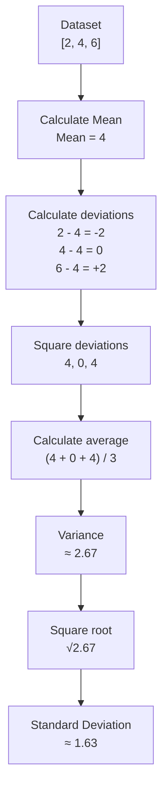
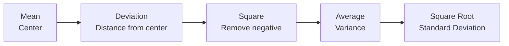

# Standard Deviation & Variance

## 1. What is Standard Deviation?

`Standard deviation (SD)` tells us how much the values in a dataset are `spread out from their mean (average)`.

In simple words:

> Standard deviation tells us how far the values are from the average.

### Example

Consider two datasets:

```text
A = [49, 50, 51], Mean(A) = 50

B = [10, 50, 90], Mean(B) = 50
```

But their spread is very different:

```text
A:
49    50    51
      ↑
    Mean

Values are close to the mean → Small Standard Deviation
```

```text
B:

10          50          90
            ↑
          Mean

Values are far from the mean → Large Standard Deviation
```

So, `mean tells us the center` while `standard deviation tells us the spread`.

> STD tells how much differences they have among the data

i.e

> STD tell how the spread

---

## 2. Why Do We Need Standard Deviation?

Standard deviation gives us a number that describes the data spread.

```text
Small SD → values are close to the mean

Large SD → values are far from the mean
```

---

## Derivation

### 3. Start With a Simple Dataset

Let's use:

```text
Data = [2, 4, 6]
```

First calculate the mean:

```text
Mean = (2 + 4 + 6) / 3  = 4
```

---

## 4. Deviation = Calculate the Distance From the Mean

Now find how far each value is from the mean.

```text
Value     Mean     Difference(deviations)

  2        4          -2
  4        4           0
  6        4          +2
```

---

## 5. Why Can't We Just Average the Differences?

Let's try:

```text
Differences = [-2, 0, +2]
Avg = (-2 + 0 + 2) / 3 = 0
```

But this is clearly wrong as a measure of spread - The values are not all the same.

The problem is: The negative and positive differences cancel each other

We need a way to make all differences positive.

---

### 6. Square the Differences

We solve the cancellation problem by **squaring each difference**.

```text
Difference     Squared Difference

   -2                4
    0                0
   +2                4
```

Now all values are positive.

---

### 7. Variance

Now calculate the average of Squared Differences

```text
(4 + 0 + 4) / 3 = 8 / 3 ≈ 2.67
this is called variance.
```

```text
Variance = Average of squared differences from the mean
```

```text
Variance  = Sum of squared differences ÷ Number of values
```

Variance tells us:

> On average, how large are the squared distances from the mean?

---

## 9. Why Do We Need Square Root?

Variance has one problem.

Suppose our original data represents `marks`:

```text
10 marks
20 marks
30 marks
```

The differences from the mean are also measured in `marks`.

But we squared them:

```text
marks²
```

Therefore variance is expressed in `squared units`.

That isn't very intuitive.

So we take the square root of the variance.

```text
Standard Deviation = √ Variance
```

For above example:

```text
Variance = 2.67

Standard Deviation = √2.67 ≈ 1.63
```

Now the result is back in the `same unit as the original data`.

---

### 10. Process Deriving Standard Deviation

The complete process is:



In simple mathematical notation:

```text

Mean = Sum of values / Number of values

        ↓

Deviation = Value - Mean

        ↓

Squared Deviation = (Value - Mean)²

        ↓

Variance  = Average of squared deviations

        ↓

Standard Deviation = √Variance
```

---

### 15. Population Standard Deviation vs Sample Standard Deviation

There are two common cases.

#### Population

Use this when your dataset represents the `entire population` you are studying.

```text
Variance  = Sum of squared deviations ÷ Number of values

Standard Deviation = √Variance
```

For example, if you have the marks of `every student in a class` and want the spread of that exact class, you can treat those marks as the population.

---

#### Sample

Sometimes you only have a `sample` from a larger population.

For example:

```text
Population = all students in India

Sample = 1,000 students
```

In this case, variance uses:

```text
Number of values - 1
```

So

```text
Sample: Variance  = Sum of squared deviations ÷ (n - 1)
```

The `n - 1` adjustment is called `Bessel's correction`.

#### Remember

For now, the important thing to remember is:

```text
Population → divide by N

Sample → divide by n - 1
```

---

#### 16. Standard Deviation in NumPy

NumPy provides `np.std()`:

```python
import numpy as np

data = np.array([2, 4, 6])

print(np.mean(data))
print(np.var(data))
print(np.std(data))
```

Output:

```text
4.0
2.6666666666666665
1.632993161855452
```

We can verify the relationship:

```python
np.sqrt(np.var(data))
```

This gives approximately:

```text
1.632993161855452
```

which is the same as:

```python
np.std(data)
```

So:

```text
Variance = np.var(data)
    ↓
Standard Deviation = np.sqrt(np.var(data))
    ↓
Standard Deviation = np.std(data)

```

---

### 17. One More Example

Consider:

```text
Data = [10, 10, 10, 10, 10]
```

Mean:

```text
Mean = 10
```

Every value is exactly equal to the mean.

Therefore:

```text
Deviation:

10 - 10 = 0
10 - 10 = 0
10 - 10 = 0
10 - 10 = 0
10 - 10 = 0
```

Squared deviations:

```text
0, 0, 0, 0, 0
```

Variance:

```text
0
```

Standard deviation:

```text
√0 = 0
```

Therefore:

```text
SD = 0
```

This makes sense because there is `no spread at all`.

---

### 18. Easy Way to Remember



Remember these three ideas:

```text
Mean → Where is the center?

Variance → How large are the squared deviations?

Standard Deviation → How spread out are the values, in the original units?
```

---

### 19. Final Summary

### Mean

```text
Mean = Average
```

It tells us the `center` of the data.

### Variance

```text
Variance = Average of squared distances from the mean
```

It measures spread but is expressed in `squared units`.

### Standard Deviation

```text
Standard Deviation = √Variance
```

It measures spread in the `same units as the original data`.

### Most important concept

```text
Small Standard Deviation → Data points are close to the mean

Large Standard Deviation → Data points are far from the mean

Zero Standard Deviation → All values are identical
```

### The complete journey

```text
DATA
  ↓
MEAN
  ↓
DISTANCE FROM MEAN
  ↓
SQUARE DISTANCES
  ↓
AVERAGE
  ↓
VARIANCE
  ↓
SQUARE ROOT
  ↓
STANDARD DEVIATION
```

> Standard deviation is a measure of how spread out the data is around its mean.

### Standard Deviation Formula

$$
\sigma = \sqrt{\frac{1}{N}\sum_{i=1}^{N}(x_i-\mu)^2}
$$

Where:

- `σ` = Standard deviation
- `N` = Number of data points
- `xᵢ` = Individual data point
- `μ` = Mean
