# AI / ML — Module 1 Notes

## 1. AI, ML and DL

### Artificial Intelligence (AI)

`Artificial Intelligence (AI)` = Making machines behave intelligently like humans

Examples:

- Image recognition
- Speech recognition
- Decision making
- Natural language understanding
- Autonomous driving

### Machine Learning (ML)

`Machine Learning` is a subset of AI where machines learn patterns from data and use those patterns to make predictions or decisions.

```mermaid
flowchart TD
    AI["Artificial Intelligence (AI)"]
    ML["Machine Learning (ML)"]
    DL["Deep Learning (DL)"]

    AI --> ML
    ML --> DL
````

### Deep Learning (DL)

`Deep Learning` is a subset of Machine Learning that uses `neural networks` with multiple layers to learn complex patterns from data.

```mermaid
flowchart LR
    D["Data"] --> N["Neural Network"]
    N --> P["Prediction / Output"]
```

---

## 2. Types of Machine Learning

Machine Learning can mainly be divided into:

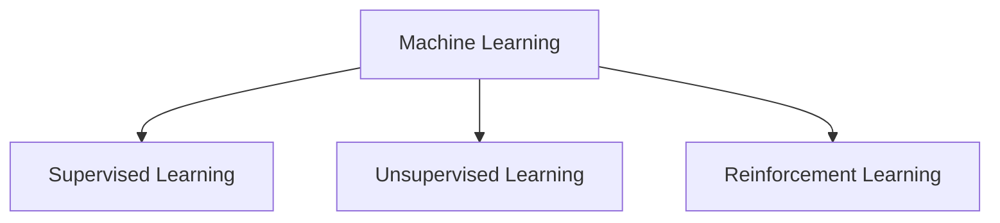

---

## 3. Supervised Learning

`Supervised Learning` learns from `labelled data`.

The model is given:

- Input data
- Correct output/label

The model learns the relationship between the input and output and then predicts the output for new data.

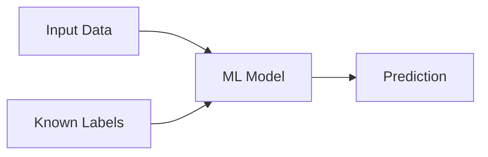

### Example

Suppose we have images of:

- Mango
- Apple

and each image is labelled accordingly.

The model learns from these labelled examples and can later predict whether a new image is a `Mango` or an `Apple`.

```text
Training Data

Image → Label
Mango → Mango
Apple → Apple
Mango → Mango
Apple → Apple

            ↓
       ML Model
            ↓
New Image → Mango / Apple
```

## Types of Supervised Learning

Supervised Learning is mainly divided into:

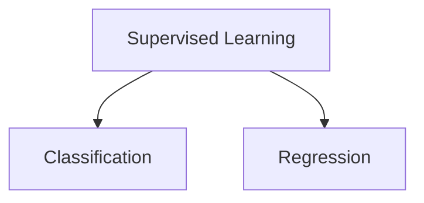

---

## 3.1 Classification

`Classification` is used when the output is a `class/category` or a `discrete value`.

Examples:

- Male / Female
- True / False
- Spam / Not Spam
- Cat / Dog
- Disease / No Disease

There is generally no meaningful middle value between classes.

Example:

```text
Input → Model → Output

Email → ML Model → Spam
Email → ML Model → Not Spam
```

### Common Classification Algorithms

- Decision Tree Classification
- Random Forest
- K-Nearest Neighbours (KNN)

---

## 3.2 Regression

`Regression` is used when the output is a `quantity` or `continuous numerical value`.

Examples:

- Salary
- Age
- House price
- Temperature
- Rainfall

Example:

```text
Input → Model → Continuous Value

Experience → ML Model → ₹12,50,000 salary
Area       → ML Model → ₹75,00,000 house price
```

### Common Regression Algorithms

- Linear Regression
- Polynomial Regression
- Support Vector Regression (SVR)

> Note: `Logistic Regression` is generally used for classification, despite having "Regression" in its name.

---

## 4. Unsupervised Learning

`Unsupervised Learning` works with `unlabelled data`.

There is no predefined output/label provided to the model.

The model tries to discover hidden patterns, structures, or relationships within the data.

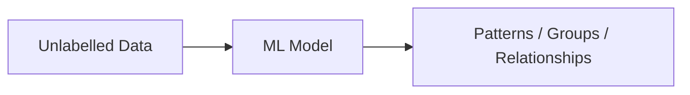

The two important areas covered here are:

- Clustering
- Association

---

## 4.1 Clustering

`Clustering` means grouping similar data points together.

The model receives unlabelled data and identifies groups based on similarity.

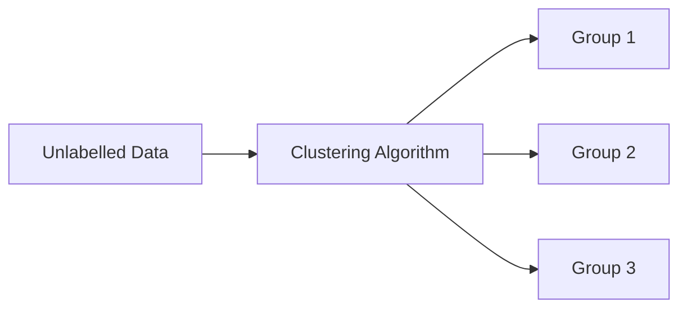

### Example — Mobile Network

A mobile network provider can analyse user usage data.

For example:

- Call usage
- Internet usage
- SMS usage
- Data consumption

Users with similar behaviour can be grouped together.

```text
                 Users
                   │
                   ▼
             Usage Data
                   │
                   ▼
             Clustering
              /      \
             /        \
      High Call      High Internet
        Users            Users
           │                │
           ▼                ▼
      Call-based       Data-based
       packages         packages
```

The provider can then offer different packages based on the behaviour of each group.

---

## 4.2 Association

`Association` is used to find important relationships between data items.

### Example — Supermarket

Suppose customers frequently purchase:

```text
Bread + Milk
```

The system may discover an association between these products.

If a customer buys bread, the system can recommend milk.

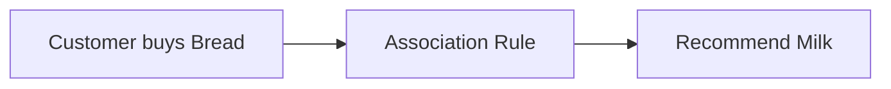

### Other Examples

- Netflix / Prime movie recommendations
- Product recommendations in e-commerce
- "Customers who bought X also bought Y"
- Identifying frequently purchased product combinations

---

## 5. Reinforcement Learning

`Reinforcement Learning (RL)` is a type of Machine Learning where an `agent` learns by interacting with an `environment`.

The agent takes actions and receives rewards or penalties.

The goal is to learn actions that maximize the total reward.

### Main Components

1. Environment
2. Agent
3. Action
4. Reward

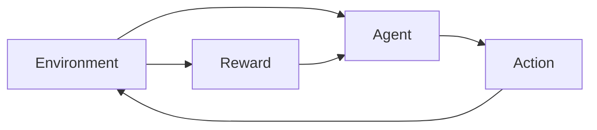

### Example - Reinforcement

A game-playing AI:

```text
Environment → Game
Agent       → AI player
Action      → Move
Reward      → Points / Winning
```

The agent tries different actions and learns which actions result in higher rewards.

---

## 6. Deep Learning

`Deep Learning` is a subset of Machine Learning that uses `Artificial Neural Networks` to learn patterns from data.

A neural network generally contains:

- Input layer
- Hidden layers
- Output layer

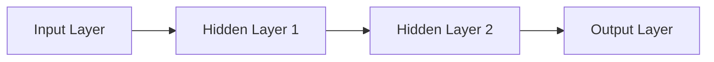

### Example — Image Detection

For an image detection problem:

```text
Image
  ↓
Input Layer
  ↓
Hidden Layers
  ↓
Feature Extraction
  ↓
Classification
  ↓
Output
```

For example:

```text
Image → Neural Network → Car / Not Car
```

The neural network can learn useful features from the image, such as:

- Edges
- Shapes
- Wheels
- Other visual patterns

---

## 7. Machine Learning vs Deep Learning

Consider an image classification problem:

`Is this image a car or not a car?`

## Traditional Machine Learning

In traditional ML, feature extraction is generally performed separately before classification.

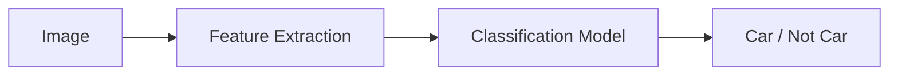

For example, we may manually identify features such as:

- Wheels
- Shape
- Windows
- Size

These features are then given to the ML model.

---

## Deep Learning

Deep Learning can learn useful features automatically from the raw input.

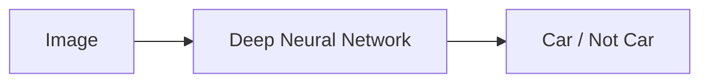

The neural network performs both:

- Feature extraction
- Classification

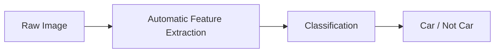

### Key Difference

```text
Traditional ML:

Input
  ↓
Feature Extraction
  ↓
Classification
  ↓
Output


Deep Learning:

Input
  ↓
Feature Extraction
      +
Classification
  ↓
Output
```

Deep Learning is particularly powerful for complex data such as:

- Images
- Audio
- Video
- Natural language

---

## 8. Applications of Deep Learning

Some important applications of Deep Learning include:

- Healthcare
- Autonomous cars
- Computer Vision
- Natural Language Processing (NLP)

### Computer Vision

Computer Vision allows computers to understand and process visual information.

Examples:

- Face recognition
- Image classification
- Object detection
- Image segmentation

### Natural Language Processing

`Natural Language Processing (NLP)` deals with understanding and processing human language.

Examples:

- Voice assistants
- Text classification
- Translation
- Chatbots
- Speech recognition

Example:

```text
Human Language
      ↓
      NLP
      ↓
AI Assistant
```

---

## 9. Important Algorithms

## Supervised Learning Algorithms

### Classification

1. Decision Tree Classification
2. Random Forest
3. K-Nearest Neighbours (KNN)

### Regression

1. Linear Regression
2. Polynomial Regression
3. Support Vector Regression (SVR)

---

## Unsupervised Learning Algorithms

1. K-Means Clustering
2. Hierarchical Clustering
3. Principal Component Analysis (PCA)
4. Apriori
5. ECLAT

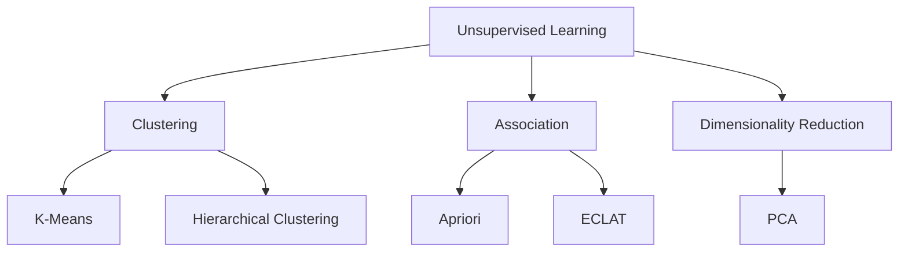

---

## 10. Quick Revision

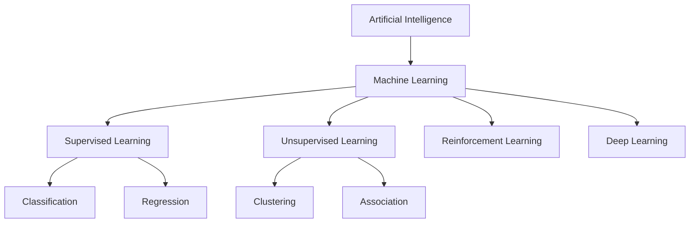

## One-line Definitions

- `AI` → Machines performing tasks that require human-like intelligence.
- `ML` → Machines learning patterns from data.
- `DL` → ML using deep neural networks.
- `Supervised Learning` → Learning from labelled data.
- `Classification` → Predicting a category/class.
- `Regression` → Predicting a continuous numerical value.
- `Unsupervised Learning` → Learning from unlabelled data.
- `Clustering` → Grouping similar data points.
- `Association` → Finding relationships between data items.
- `Reinforcement Learning` → Learning through actions and rewards.
- `Neural Network` → A computational model inspired by interconnected neurons, organized into layers.
