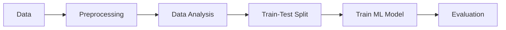

# AI / ML — Video1 - Module 2 Notes

## Correlation

- relation b/w two features / attributes
- measures how strongly two variables are related to each other and in which direction
- eg:
  - As study hours increase, exam marks increase → `positive correlation`
  - As price increases, demand decreases → `negative correlation`
  - No clear relationship → `no correlation`

## Central Tendencies ( Avg / Mean, Mode, Media )

- `Mean / Average` → Sum of all values ÷ Number of values
  - Example: `10, 20, 30`
  - Mean = `(10 + 20 + 30) / 3 = 20`

- `Median` → Middle value after sorting the data
  - Example: `10, 20, 30`
  - Median = `20`

- `Mode` → Value that appears most frequently
  - Example: `10, 20, 20, 30`
  - Mode = `20`

## Handling Missing Data

1. `Imputation`

    - Imputation means replacing missing values with a suitable statistical value
      - [ Central tendencies = Avg (Mean), Mode, Medain ]

2. `Dropping`

    - removing the rows or columns that contain missing values

- [Refer Doc](./2_handling_missing_data.md)
- [Example Code](./notebooks/4.3.Handling_Missing_Values.ipynb)

## [Data Standerdization]

- converting numerical data to a common scale with Mean = 0 and Standard Deviation = 1.

- [Refer Doc](./3_data_standardization.md)
- [Example Code](./notebooks/4.4.Data_Standardization.ipynb)

## Label Encoding

- is the process of converting categorical values into numerical values so that a ML model can work with them.

- [Refer Doc](./4_label_encoding.md)
- [Example Code](./notebooks/4.5.Label_Encoding.ipynb)

## ML Project Workflow



- [Refer Doc](./5_ML_project_workflow.md)

## Handling Imbalanced Data ( Under/Over Sampling )

- `Undersampling` → Reducing the number of samples in the majority class `to match minority class`.

- `Oversampling` → Increasing the number of samples in the minority class `to match majority class`.

- [Refer Doc](./6_handling_imbalanced_data.md)
- [Example Code](./notebooks/4.7.Handling_imbalanced_Dataset.ipynb)

## Feature Extraction ( TF-IDF ) - Text Data Pre-Processing

```text

Feature Extraction → Converts text into numerical features that can be given to an ML model.

BoW → represents unique words present in the entire text corpus. ( Represents text using word occurrences. )

TF → How frequently a word appears in a document.

IDF → How rare a word is across documents.

TF-IDF
→ TF × IDF
→ Gives higher importance to words that are frequent in a document but relatively rare across documents.

```

A word gets a high TF-IDF score when:

- It appears frequently in a particular document
- It does not appear frequently in many other documents

### Stop Words

`Stop words` → Common words that are often removed from text because they usually provide little useful information for NLP/ML models.

Examples: `the`,`is`,`a`,`an`,`and`,`in`,`of`,`to`,`for`

- we use `nltk` to remove stop words in AI-ML projects

### Stemming

`Stemming` is the process of reducing a word to its Root word
example: actor, actress, acting --> act

- for stemming we use `PorterStemmer` from `nltk.stem.porter` in AI-ML projects

### Reference

- [Refer Doc](./7_feature_extraction_TF-IDF.md)
- [Example Code - Fetaure Extraction for Fake News Data](./notebooks/4.8.Feature_extraction_of_Text_data_using_Tf_idf_Vectorizer.ipynb)

## Numerical Data Pre-Processing

- [Example Code - Numerical Data Pre-Processing for Diabetes Data](./notebooks/4.9.Numerical_Dataset_Pre_Processing_Use_Case.ipynb)

## Text Data Pre-Processiong

- [Example Code - Text Data Pre-Processing for Fake News Data](./notebooks/4.10.Text_Data_Pre_Processing_Use_Case.ipynb)
