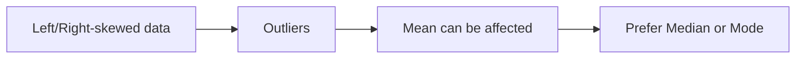
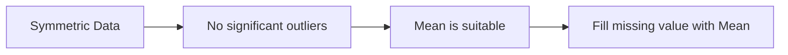
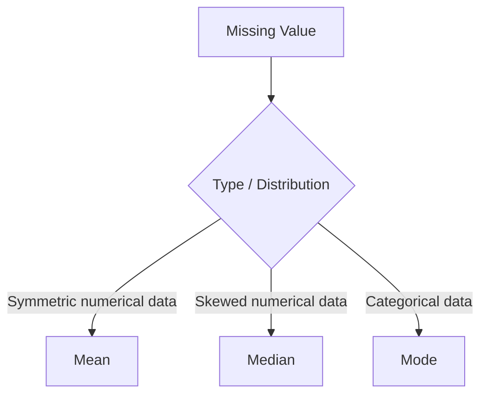

# AI / ML — Video1 - Module 2 Notes

## Handling Missing Data

1. `Imputation`

    - Imputation means replacing missing values with a suitable statistical value
      - [ Central tendencies = Avg (Mean), Mode, Medain ]

2. `Dropping`

    - removing the rows or columns that contain missing values

### Choosing Mean, Median or Mode

depends on the distribution of the data.

#### Left/Right-Skewed Data

In left/right-skewed data, there may be outliers on the left/right side.

For skewed data, `Median` is generally preferred over `Mean` because the median is less affected by outliers.

Example:

`10, 20, 20, 25, 30, 100`

- Mean is affected by the `100`
- Median is less affected by the `100`

So, for skewed numerical data: `Missing Value → Median`

---

#### Normally Distributed / Symmetric Data

When data is approximately symmetric and has no significant outliers, we can use the `Mean`.

Example:

`20, 22, 23, 24, 25, 26, 27`

The data is approximately symmetric, so: `Missing Value → Mean`

---

#### Categorical Data

For categorical data, use the `Mode`.

Example:

`Red, Blue, Blue, Green, Blue`

- Mode = `Blue`
- Missing value → `Blue`

## Quick Rule

- `Mean` → Symmetric numerical data
- `Median` → Skewed numerical data / outliers
- `Mode` → Categorical data
- `Dropping` → Remove rows/columns with missing data when appropriate
