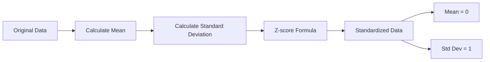

# AI / ML — Video1 - Module 2 Notes

## Data Standardization

- ```text
    converting numerical data to a common scale with Mean = 0 and Standard Deviation = 1. 
  ```

- `Z-score standardization` - is the most common method.

```text
Standardized value (Z) = (X - Mean) / Standard Deviation
```

### Example

Suppose we have:

```text
Data: 10, 20, 30
Mean: 20
SD: 8.16
```

For the value `30`:

```text
Z = (30 - 20) / 8.16
  = 10 / 8.16
  ≈ 1.225
```

- The result tells us how many `standard deviations` the value is away from the mean.

- So 30 is approximately 1.225 standard deviations above the mean.



### Why do we need it?

Suppose a dataset has:

```text
Age       → 20 to 60
Salary    → 20,000 to 200,000
```

Salary has much larger numerical values than Age.

Some ML algorithms can be influenced by these different scales.

After standardization:

```text
Age       → roughly -2 to +2
Salary    → roughly -2 to +2
```

Now both features are on a comparable scale.

### Simple definition

```text
Standardization = Converting data to a common scale with Mean = 0 and Standard Deviation = 1.
```

Note: `Standardization` and `Normalization` are different techniques.

### Note

we use `StandardScaler` from `sklearn` for Standardization in Python AI-ML projects
