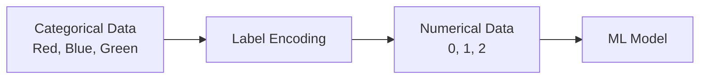

# AI / ML — Video1 - Module 2 Notes

## Label Encoding

`Label Encoding` is the process of converting categorical values into numerical values so that a ML model can work with them.

### Example

Suppose we have a `Color` column:

```text
Color
-----
Red
Blue
Green
Blue
Red
```

After Label Encoding:

```text
Color    Encoded
-----    -------
Red      0
Blue     1
Green    2
Blue     1
Red      0
```

The mapping could be:

```text
Red   → 0
Blue  → 1
Green → 2
```



### Important Point

Label Encoding assigns a unique number to each category.

`Red → 0`, `Blue → 1`, `Green → 2`

However, the numbers can sometimes create an unintended ordering.

For example:

```text
Small  → 0
Medium → 1
Large  → 2
```

Here, the numerical order makes sense.

But:

```text
Red   → 0
Blue  → 1
Green → 2
```

There is no natural meaning that `Green > Blue > Red`.

`Note:-` For categorical features without an inherent order, `One-Hot Encoding` is often more appropriate than Label Encoding.

## Note:-

- use `LabelEncoder` from `sklearn` for Label Encoding in AI-ML project
