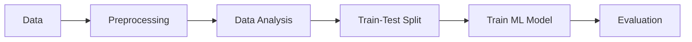
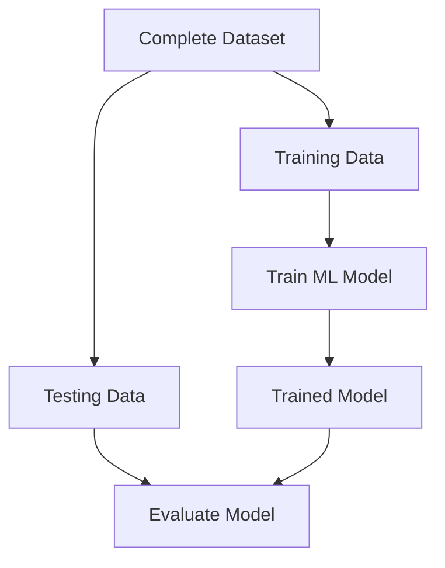
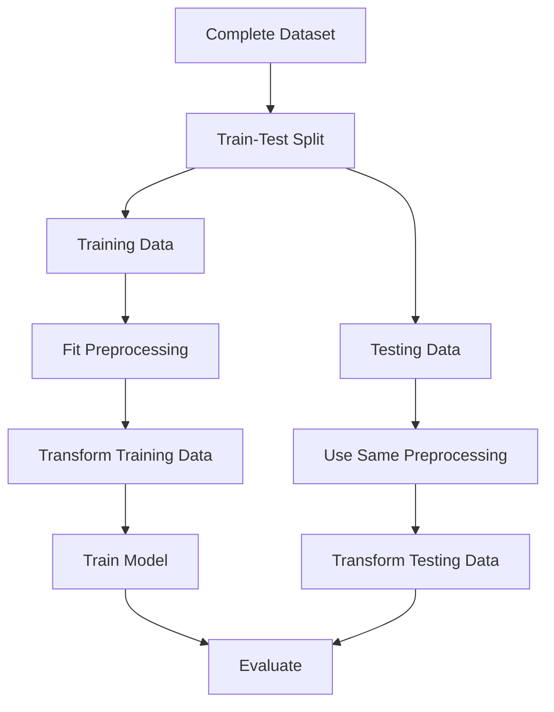

# ML Project Workflow

A typical Machine Learning project follows these steps:



## 1. Data

Collect or obtain the data required for the ML problem.

Examples:

* CSV files
* Databases
* APIs
* Sensors
* Web data

```text
Data → Raw dataset
```

## 2. Preprocessing

Prepare the raw data so that it can be used by the ML model.

Common preprocessing tasks:

* Handling missing data
* Removing duplicates
* Handling outliers
* Encoding categorical data
* Data standardization
* Data normalization
* Converting data into suitable formats

Example:

```text
"Male", "Female"
        ↓
Label Encoding
        ↓
0, 1
```

## 3. Data Analysis

Understand the data before building the model.

This is commonly done using `EDA (Exploratory Data Analysis)`.

Things we may analyze:

* Distribution of data
* Mean, Median, Mode
* Correlation
* Outliers
* Relationships between features
* Feature importance

Example:

```text
Age  ────────────────┐
                     ├──> Analyze relationship
Salary ──────────────┘
```

## 4. Train-Test Split

`Train-Test Split` means dividing the dataset into two parts:

* `Training data` → Used to train the ML model
* `Testing data` → Used to evaluate the trained model



### Why do we split the data?

The model needs to learn from some data and then be tested on `unseen data`.

For example, suppose we have `1000` records.

```text
Dataset = 1000 records

Training data = 800 records
Testing data  = 200 records
```

The model learns from the `800 training records`.

Then we give it the `200 testing records` that it has not seen during training.

This helps us determine whether the model can `generalize` to new data.

### Example

Suppose we want to predict house prices.

```text
House data:

Area     Bedrooms     Price
1000     2            ₹50L
1200     2            ₹60L
1500     3            ₹75L
1800     3            ₹90L
2000     4            ₹1Cr
...
```

We split the data:

```text
Training Data
    ↓
Model learns the relationship between
Area, Bedrooms → Price

Testing Data
    ↓
Model predicts Price for unseen houses
```

### Common Split Ratio

A common choice is:

```text
80% → Training
20% → Testing
```

Other common choices are:

```text
70% → Training
30% → Testing

75% → Training
25% → Testing
```

There is no universal best ratio. It depends on the dataset size and problem.

## 5. ML Model

The training data is given to an ML algorithm.

```text
Training Data
      ↓
ML Algorithm
      ↓
Trained Model
```

The model learns patterns from the training data.

For example:

```text
Area + Bedrooms → House Price
```

## 6. Evaluation

After training, we evaluate the model using the `testing data`.

```text
Testing Data
     ↓
Trained Model
     ↓
Predictions
     ↓
Compare with Actual Values
     ↓
Evaluation Metrics
```

The evaluation metric depends on the ML problem.

Examples:

* Classification → Accuracy, Precision, Recall, F1-score
* Regression → MAE, MSE, RMSE, R²

## Important: Data Leakage

```text
usage of test data in the training process
```

we should avoid data leakage.

this missing from the simple workflow above.

For example, when performing `Standardization`, calculate the mean and standard deviation using the `training data`, not the entire dataset.



`Key idea:-`

```text
Training data → Learn / Fit
Testing data  → Evaluate only
```

This prevents `data leakage` and gives a more realistic estimate of how the model will perform on new, unseen data.
