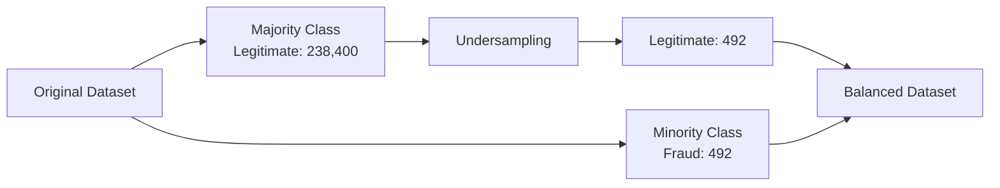

# Handling Imbalanced Dataset

## Definition

An `imbalanced dataset` is a dataset where the classes are not distributed equally.

Example:

```text
Diabetic patients     → 90%
Non-diabetic patients → 10%
````

Here, the dataset is `imbalanced` because one class has many more samples than the other.

Another example is `credit card fraud detection`:

```text
Legitimate transactions → 238,400
Fraud transactions       → 492
```

The `Fraud` class is the minority class, while `Legitimate` is the majority class.

## Why Is Imbalance a Problem?

If we train a model directly on highly imbalanced data, the model may become biased toward the majority class.

For example:

```text
Total transactions = 238,892

Legitimate = 238,400
Fraud      = 492
```

A model that predicts `Legitimate` for every transaction would achieve about `99.8% accuracy`, but it would detect `0` fraud transactions.

Therefore, `accuracy` alone can be misleading for highly imbalanced datasets.

## Handling Imbalanced Data

One common approach is `Undersampling`.

### Undersampling

- `Undersampling` → Reducing the number of samples in the majority class `to match minority class`.

Example:

```text
Before undersampling:

Legitimate → 238,400
Fraud      →     492
```

We can randomly select approximately `492` legitimate transactions:

```text
After undersampling:

Legitimate → 492
Fraud      → 492
```

Now the classes are balanced.



## Key Point

```text
Undersampling
    ↓
Reduce majority-class samples
    ↓
Keep minority-class samples
    ↓
Create a more balanced dataset
```

`Note:-` Undersampling is simple and can work well, but it throws away some majority-class data. Another common approach is `Oversampling`, where we increase the minority-class samples instead.
