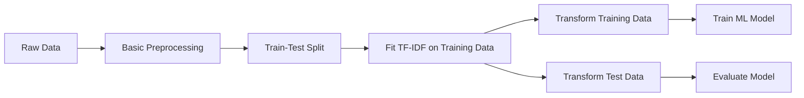

# Feature Extraction of Text Data

`Feature Extraction` is the process of converting text data into numerical values so that Machine Learning models can understand and process it.

For text data, one common feature extraction technique is `TF-IDF`.

## TF-IDF

`TF-IDF` stands for `Term Frequency - Inverse Document Frequency`.

It gives a numerical score to a word based on:

- How frequently the word appears in a document
- How rare or common the word is across all documents

```mermaid
flowchart LR
    A[Text Data] --> B[Text Preprocessing]
    B --> C[TF-IDF]
    C --> D[Numerical Vectors]
    D --> E[ML Model]
````

## Bag of Words

`Bag of Words (BoW)` represents unique words present in the entire text corpus.

Example:

```text
Document 1: "I like Python"
Document 2: "I like Machine Learning"
```

Unique words:

```text
I
like
Python
Machine
Learning
```

These words form the `vocabulary`.

Each document can then be represented as a numerical vector based on word occurrence.

```text
Text
  ↓
Unique Words / Vocabulary
  ↓
Numerical Representation
  ↓
ML Model
```

## Term Frequency (TF)

`Term Frequency (TF)` measures how frequently a term appears in a document.

Formula:

$$
TF(t,d) = \frac{\text{Number of times term }t\text{ appears in document }d}
{\text{Total number of terms in document }d}
$$

Example:

```text
Document:
"I like Python and I like ML"

Total terms = 6

"I" appears 2 times

TF("I") = 2 / 6
        = 0.333
```

So, higher frequency of a word in a document generally gives a higher `TF`.

## Inverse Document Frequency (IDF)

`Inverse Document Frequency (IDF)` measures how rare a word is across the entire collection of documents.

Formula:

$$
IDF(t) = \log\left(\frac{N}{df(t)}\right)
$$

Where:

- `N` = Total number of documents
- `df(t)` = Number of documents containing term `t`

The idea is:

```text
Word appears in many documents
        ↓
Word is common
        ↓
Lower IDF
```

```text
Word appears in fewer documents
        ↓
Word is rare
        ↓
Higher IDF
```

## TF-IDF Formula

TF-IDF combines `TF` and `IDF`.

Formula:

$$
TF\text{-}IDF(t,d) = TF(t,d) \times IDF(t)
$$

So:

```text
TF-IDF
   ↓
TF × IDF
   ↓
Numerical score for a word
```

A word gets a high TF-IDF score when:

- It appears frequently in a particular document
- It does not appear frequently in many other documents

## Simple Example

Suppose we have:

```text
Document 1: "Python is easy"
Document 2: "Python is powerful"
Document 3: "Java is powerful"
```

The word `Python` appears in 2 out of 3 documents.

The word `easy` appears in only 1 document.

Therefore:

```text
"Python" → More common → Lower IDF
"easy"   → More rare   → Higher IDF
```

This helps TF-IDF give more importance to words that are more useful for distinguishing documents.

## Why Use TF-IDF?

Machine Learning models generally require numerical input.

TF-IDF converts:

```text
Text
  ↓
Words
  ↓
TF-IDF scores
  ↓
Numerical vectors
  ↓
ML Model
```

For example, TF-IDF can be used for:

- Spam email classification
- Sentiment analysis
- News classification
- Document classification
- Text similarity
- Search systems

## Where Is It Used in the ML Workflow?

TF-IDF is part of `Feature Extraction`, which is generally considered part of `Data Preprocessing / Feature Engineering`.

However, there is an important point about the order.

The safe workflow is:



`Important:-` Do not fit TF-IDF using the entire dataset before the train-test split. The vocabulary and IDF values should be learned from the training data only. Otherwise, information from the test set can leak into the training process.

## ML Workflow Position

```text
Raw Data
    ↓
Basic Data Preprocessing
    ↓
Train-Test Split
    ↓
Feature Extraction
    ↓
TF-IDF
    ↓
Numerical Features
    ↓
Train ML Model
    ↓
Evaluation
```

## Quick Summary

```text
Feature Extraction → Converts text into numerical features that can be given to an ML model.

BoW → represents unique words present in the entire text corpus. ( Represents text using word occurrences. )

TF → How frequently a word appears in a document.

IDF → How rare a word is across documents.

TF-IDF
→ TF × IDF
→ Gives higher importance to words that are frequent in a document but relatively rare across documents.

```

we use `TfidfVectorizer` form `sklearn.feature_extraction.text` to do TF-IDF vectorization in AI-ML projects

## Other Concepts

### Stop Words

`Stop words` → Common words that are often removed from text because they usually provide little useful information for NLP/ML models.

Examples: `the`,`is`,`a`,`an`,`and`,`in`,`of`,`to`,`for`

- we use `nltk` to remove stop words in AI-ML projects

### Stemming

`Stemming` is the process of reducing a word to its Root word
example: actor, actress, acting --> act

- for stemming we use `PorterStemmer` from `nltk.stem.porter` in AI-ML projects
